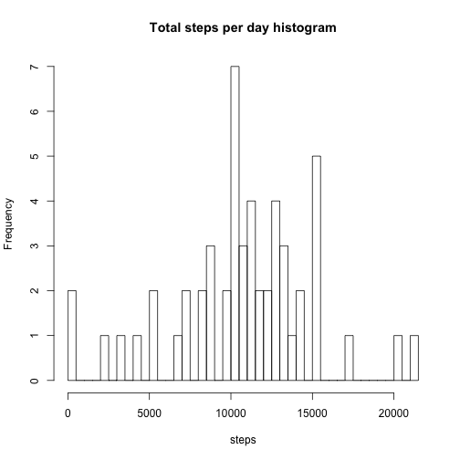
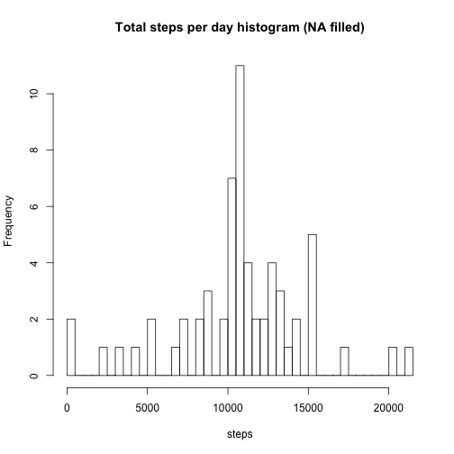

## Loading and preprocessing the data

Load the data:


```r
unzip(zipfile="repdata-data-activity.zip")
```

```
## Warning in unzip(zipfile = "repdata-data-activity.zip"): error 1 in
## extracting from zip file
```

```r
acti.data <- read.csv("activity.csv",header=T)
head(acti.data,3)
```

```
##   steps       date interval
## 1    NA 2012-10-01        0
## 2    NA 2012-10-01        5
## 3    NA 2012-10-01       10
```

Process/transform the data (if necessary) into a format suitable for your analysis


## What is mean total number of steps taken per day?

For now, ignore the missing values in the dataset and calculate the total number of steps taken per day:


```r
acti.complete <- acti.data[complete.cases(acti.data),]
total.steps <- aggregate(data=acti.complete,steps~date,sum)
total.steps
```

```
##          date steps
## 1  2012-10-02   126
## 2  2012-10-03 11352
## 3  2012-10-04 12116
## 4  2012-10-05 13294
## 5  2012-10-06 15420
## 6  2012-10-07 11015
## 7  2012-10-09 12811
## 8  2012-10-10  9900
## 9  2012-10-11 10304
## 10 2012-10-12 17382
## 11 2012-10-13 12426
## 12 2012-10-14 15098
## 13 2012-10-15 10139
## 14 2012-10-16 15084
## 15 2012-10-17 13452
## 16 2012-10-18 10056
## 17 2012-10-19 11829
## 18 2012-10-20 10395
## 19 2012-10-21  8821
## 20 2012-10-22 13460
## 21 2012-10-23  8918
## 22 2012-10-24  8355
## 23 2012-10-25  2492
## 24 2012-10-26  6778
## 25 2012-10-27 10119
## 26 2012-10-28 11458
## 27 2012-10-29  5018
## 28 2012-10-30  9819
## 29 2012-10-31 15414
## 30 2012-11-02 10600
## 31 2012-11-03 10571
## 32 2012-11-05 10439
## 33 2012-11-06  8334
## 34 2012-11-07 12883
## 35 2012-11-08  3219
## 36 2012-11-11 12608
## 37 2012-11-12 10765
## 38 2012-11-13  7336
## 39 2012-11-15    41
## 40 2012-11-16  5441
## 41 2012-11-17 14339
## 42 2012-11-18 15110
## 43 2012-11-19  8841
## 44 2012-11-20  4472
## 45 2012-11-21 12787
## 46 2012-11-22 20427
## 47 2012-11-23 21194
## 48 2012-11-24 14478
## 49 2012-11-25 11834
## 50 2012-11-26 11162
## 51 2012-11-27 13646
## 52 2012-11-28 10183
## 53 2012-11-29  7047
```

Here is a histogram of the total number of steps taken each day:


```r
hist(total.steps$steps,breaks=50,main="Total steps per day histogram",xlab="steps")
```

 

The mean of steps taken per day is:

```r
steps.mean <- mean(total.steps$steps)
steps.mean
```

```
## [1] 10766.19
```

The mean of steps taken per day is:

```r
steps.median <- median(total.steps$steps)
steps.median
```

```
## [1] 10765
```

## What is the average daily activity pattern?

Make a time series plot (i.e. type = "l") of the 5-minute interval (x-axis) and the average number of steps taken, averaged across all days (y-axis)


```r
mean.steps.to.interval <- aggregate(data=acti.complete,steps~interval,mean)
plot(steps~interval,data=mean.steps.to.interval, type="l")
```

 

Which 5-minute interval, on average across all the days in the dataset, contains the maximum number of steps?


```r
mean.steps.to.interval[which.max(mean.steps.to.interval$steps),]$interval
```

```
## [1] 835
```


## Imputing missing values

Note that there are a number of days/intervals where there are missing values (coded as NA). The presence of missing days may introduce bias into some calculations or summaries of the data.

The total number of missing values in the dataset is:


```r
sum(is.na(acti.data))
```

```
## [1] 2304
```

To devise a strategy for filling in all of the missing values in the dataset:
(1) If the mean for that day is not NA, fill the missing data with the mean of that day.
(2) If the mean for that day is NA, fill the missing data with the mean of the whole dataset (without counting in the samples with NA).
The resulting acti.data2 dataset has all the NA replaced:


```r
mean.steps.to.date <- aggregate(data=acti.complete,steps~date,mean)
acti.data2 <- acti.data

for(i in 1: length(acti.data2$steps))
{
  if(is.na(acti.data2[i,1])) 
  {
    if(length(which(mean.steps.to.date == as.character(acti.data2[i,2]))) > 0)
    acti.data2[i,1] <- mean.steps.to.date[which(mean.steps.to.date == as.character(acti.data2[i,2])),2]
    
    else acti.data2[i,1] <- (sum(acti.complete$steps)/length(acti.complete$steps))
  }
}
```


Make a histogram of the total number of steps taken each day:


```r
total.steps2 <- aggregate(data=acti.data2,steps~date,sum)
hist(total.steps2$steps,breaks=50,main="Total steps per day histogram (NA filled)",xlab="steps")
```

 

Calculate and report the mean and median total number of steps taken per day:

Now, the mean of steps taken per day is:

```r
steps.mean <- mean(total.steps2$steps)
steps.mean
```

```
## [1] 10766.19
```

And the mean of steps taken per day is:

```r
steps.median <- median(total.steps2$steps)
steps.median
```

```
## [1] 10766.19
```

Do these values differ from the estimates from the first part of the assignment? What is the impact of imputing missing data on the estimates of the total daily number of steps?

  - The mean and median are closer to each other after filling in the missing values.

## Are there differences in activity patterns between weekdays and weekends?

For this part the weekdays() function may be of some help here. Use the dataset with the filled-in missing values for this part.

Create a new factor variable in the dataset with two levels – “weekday” and “weekend” indicating whether a given date is a weekday or weekend day.


```r
acti.data2$weekdays <- weekdays(as.Date(acti.data2$date))
for(i in 1:length(acti.data2$date))
{
  if (acti.data2[i,]$weekdays %in% c("Monday", "Tuesday", "Wednesday", "Thursday", "Friday"))
          acti.data2[i,]$weekdays <- "weekday"
  
  else   
          acti.data2[i,]$weekdays <- "weekend"
}
```

Now, the variable "weekdays" in the dataset indicates the date is a weekday or weekend:


```r
head(acti.data2)
```

```
##     steps       date interval weekdays
## 1 37.3826 2012-10-01        0  weekday
## 2 37.3826 2012-10-01        5  weekday
## 3 37.3826 2012-10-01       10  weekday
## 4 37.3826 2012-10-01       15  weekday
## 5 37.3826 2012-10-01       20  weekday
## 6 37.3826 2012-10-01       25  weekday
```

Make a panel plot containing a time series plot (i.e. type = "l") of the 5-minute interval (x-axis) and the average number of steps taken, averaged across all weekday days or weekend days (y-axis). See the README file in the GitHub repository to see an example of what this plot should look like using simulated data.


```r
library(plyr)
library(ggplot2)

steps.to.interval.by.weekdays <- aggregate(data=acti.data2, steps ~ interval + weekdays, mean)
ggplot(steps.to.interval.by.weekdays, aes(interval, steps)) + geom_line() + facet_grid(weekdays ~ .) +
    xlab("5-minute interval") + ylab("Number of steps")
```

 


